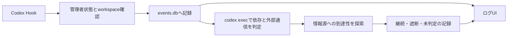

# ToolUseProxy v0.2のアーキテクチャ

現行設計は[ToolCall意味依存グラフ](ToolCall意味依存グラフ.md)を参照してください。
入口は `tooluseproxy.app`、判定の実装は `tooluseproxy/engine/` です。

新規DBでは旧解析用tableを作らず、通常Hookから旧解析器・自動整理・予測workerを起動しません。
PostToolUseでは同じToolCallノードへ実出力を反映します。実行前に未来の出力を使いません。

旧版の設計は[履歴](../history/v0.1/アーキテクチャ.md)に残しています。
