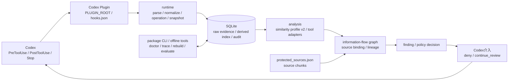

# アーキテクチャ概要

ToolUseProxyは、Codexのtool useをHookで観測し、ローカルで情報流を再構築して、protected sourceから外部sinkまたは最終応答へ到達する経路を検知・制御します。Plugin、通常のPython package、offline CLIはいずれも同じCoreを使い、Hook内でprotected sourceをremote serviceへ送信しません。

## 全体像

処理は次の境界に分かれます。

1. `hooks/`の薄いentrypointがCodex Hook payloadを受け取る
2. `hook_monitor/runtime/`がevent、artifact、operation outcome、bounded snapshotを正規化してSQLiteへ保存する
3. `hook_monitor/analysis/`がtool固有adapterと類似度profile v2からsource非依存の有向graphを作る
4. `protected_sources.json`をworkspace単位で読み、source chunkをgraphへbindingする
5. lineageをsink candidateまで伝播し、`hook_monitor/policy/`がfindingをpolicy decisionへ変換する
6. Stopはfinal answerの再確認を求め、opt-inのPreToolUseはHook-visibleなlocal toolを既知adapterまたは保守的unknownとして評価し、criticalなexternal sinkを実行前にdenyする

exactなresource operationやtool fieldを説明できる場合はstructured adapter edgeを優先し、文字列だけで結び付ける場合はboundedな類似度候補探索とpair判定を使います。類似度profile v2はcanonical exact、substring、token equivalent、shingleを段階的に評価し、full rebuildとsession incrementalで同じ候補選択規則を共有します。評価契約と固定baselineは[類似度評価](../運用/類似度評価.md)を参照してください。

## packageとPluginの境界

| 境界 | 役割 |
| --- | --- |
| `.codex-plugin/`、`hooks/hooks.json`、`skills/` | Codexが読み込むPlugin metadata、Hook配線、setup workflow |
| `hooks/` | `PLUGIN_ROOT`からCoreを起動する薄いlauncherとHook entrypoint |
| `tooluseproxy/` | install可能なpackage facade、`init` / `doctor` / `status` / `protect` / `trace` CLI |
| `hook_monitor/runtime/` | Hook payloadの記録、workspace/session差分解析、SQLite整合性境界 |
| `hook_monitor/analysis/` | graph、adapter、類似度、source binding、lineage、漏えい検知 |
| `hook_monitor/policy/` | findingからCodex Hook判断への変換、説明、redaction preview |

Plugin bundleは`PLUGIN_ROOT`からimmutableなcodeとassetを読み、SQLiteなどのmutable stateは`PLUGIN_DATA`へ保存します。Hook definitionにcheckout固有pathを埋め込まず、wheel install後もcheckout外から同じCoreをimport・起動できます。導入、trust、初期化、更新手順は[Plugin導入](../設定/Plugin導入.md)を参照してください。

offline rebuildは選択workspaceのderived graphとcompleted run snapshotを1 transactionでpublishします。一方、runtime runはHook latencyと保存量を抑えるため、現在sessionのmutable graphを差分更新します。両者は保存方法が異なりますが、adapter、類似度、source binding、lineageの意味は共有します。

## 安全な既定値

- Hookは常にlocal-only。Externality Judgeを明示的に有効化してもHookはadapter・static rule・承認済みcacheだけを参照し、未知callの値非保持要約をlocal queueへ積む。初見unknownは保守的sinkとしてgraphへ入り、protected lineageが到達した場合だけdenyする。provider通信はHook外workerを明示実行した場合だけ行う
- protected source、raw command、source code、URL、host、path、credentialはExternality Judgeへ送らず、telemetryとremote embeddingも使わない
- 未初期化DBは暗黙migrationせずsetup案内をadvisoryで返す。初期化後の互換性不一致、runtime / policy失敗、壊れたPreToolUse payloadは値を出さず実行前denyする
- `PostToolUse`は記録を行い、`Stop`はfinal answerを検査する
- PreToolUse blockは既定で無効。有効化するとHook-visibleなlocal tool全体を評価する。direct Hook開発環境ではMCP raw inputのmaterialize前上限を追加できる
- runtime redactと`updatedInput`は無効で、criticalな外部送信はdenyを維持する
- protected source候補のscan、manifest migration、登録を`init`やHookから暗黙実行しない
- coding agentはvalue-freeな候補を提示し、ユーザーがexact proposalを明示承認した後だけatomic登録を実行する
- workspace identityをevent、source、cursor、resource、edge、analysis runへ伝播し、別workspaceの同名sourceを判断へ混ぜない

redactionはpreview、hash-only audit、将来renderer向けのdormant linkageとPost confirmationまでを保持します。複数Hook rewriteの最終採用inputを証明できるexclusive enforcement境界が成立するまで、runtime rewriteは有効にしません。詳細は[Redact](Redact.md)を参照してください。

## 詳細設計

- Hook payload、設定、保存範囲: [Hook設定](../設定/Hook設定.md)
- graph、source binding、lineage、再解析: [情報流追跡](情報流追跡.md)
- tool固有のstructured edge: [アダプター](アダプター.md)
- graph上の出口: [外部流出候補](外部流出候補.md)
- findingと経路再構築: [漏えい検知](漏えい検知.md)
- policy actionとCodex Hook出力: [Policy判断](Policy判断.md)
- lineage tree、Mermaid、DOT、JSON: [可視化](可視化.md)
- 現在の優先順位と長期課題: [実装タスク](../運用/実装タスク.md)
