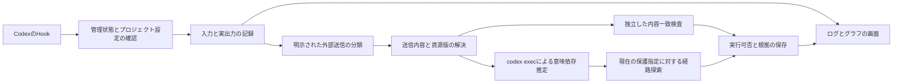

# ToolUseProxy v0.2の構成

[文書一覧](../索引.md) · [処理順とエッジ生成](エッジ生成と送信判定.md)

入口は `tooluseproxy.app`、判定処理は `tooluseproxy/engine/` です。原記録とグラフを同じ `events.db` の別テーブルに保存します。

この図は構成の関係を示しています。分岐・短縮経路・判定未完了時の扱いは[エッジ生成と送信判定](エッジ生成と送信判定.md)を参照してください。

実行前の判定には未来の出力を使いません。実行後のHookで同じToolCallに実出力と観測できた資源版を結び付けます。初期設定で同意した場合は、背景解析もモデルを利用します。

独立した判定用Codexは親の会話を暗黙に読まず、明示的に渡された記録を扱います。判定用セッションのツール・Hook・プラグインは無効にし、モデルのツール使用を検出した応答は採用しません。データ送信の境界は[プライバシー](../../PRIVACY.md)に記載しています。

通常のHookから旧解析器・旧自動整理・予測処理は起動しません。[旧版の構成](../history/v0.1/アーキテクチャ.md)は当時の記録として残しています。
