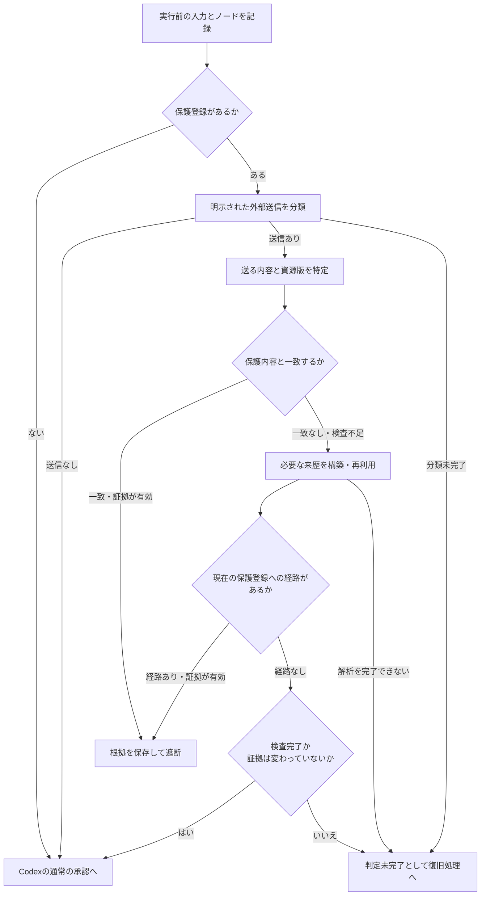
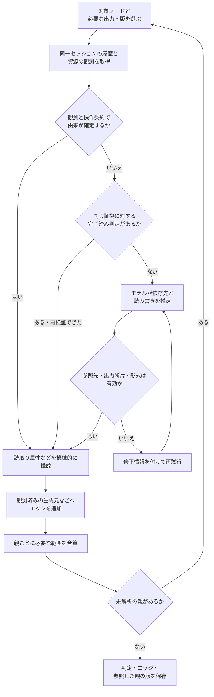
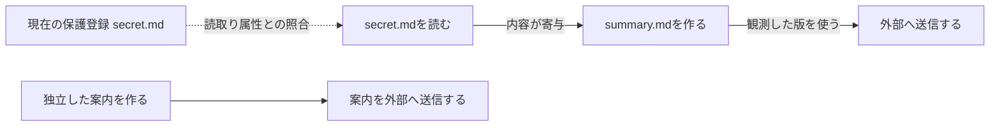

# エッジ生成と送信判定

[紹介](../../README.md) · [文書一覧](../索引.md) · [データ構造](SQLiteプロパティグラフ.md) · [実機の検証結果](../運用/alpha16検証.md)

2026年9月25日。公開版v0.2.0-alpha.16の実装を基準にしています。ここでは、現在動いているアルゴリズムを説明します。[増分グラフの設計案](増分情報継承グラフ.md)にある候補検索や局所判定の案を、実装済みの機能としては扱いません。

## 何をエッジにするのか

ノードは1回のToolCallです。入力の実行前記録と、実際に得られた出力を同じノードへ結び付けます。エッジは **情報を与えた操作から、その情報を使った操作へ** 向けます。

単に「先に実行した」「同じセッションにある」「同じファイル名が出てくる」という理由では結びません。情報が内容に寄与したかを扱います。要約、翻訳、計算、設計からのコード生成なども推定対象です。読みやすさ、可逆性、変換回数によって保護を解除する規則はありません。

ファイルの読取り・書込みはノードの属性です。ファイルの内容版、出力のどの部分が必要か、判断の根拠と版を別途保存します。全ノードを確率で採点する方式でも、経路上の確信度を掛け合わせる方式でもありません。

## 1. 実行前から実行後まで

次の図は、有効なプロジェクト設定と管理状態を確認した後の流れです。すべての「通常の承認へ」は、Codex本来の権限承認を残します。

判定未完了の場合は、再利用可能な結果を保ちながら、期限内で再試行します。完了できなければ実行を保留します。Codexが実際に操作を実行した場合だけ、PostToolUseで実出力と資源版を記録し、設定が有効なら背景解析のジョブを登録します。

機械的な操作契約で分類できる入力はモデルを呼ばず、それ以外は外部送信の分類用モデルへ渡します。判定用モデルは、入力にないスクリプト内部の通信を調査しません。分類が未完了なら「ローカルだから通す」とは扱いません。

送信対象は、コマンド文字列だけとは限りません。ファイル、記録済み出力、Gitのコミットに含まれる版、宛先の設定値などを、入力と観測可能な証拠から解決します。Gitだけを特別な漏えい判定にするのではなく、各形式の解決結果を共通の送信内容として検査します。対象の不足や検査中の変更は、内容が安全という結果に置き換えません。

DLPは特徴的なバイト列の完全一致を調べます。最小24バイト・異なるバイト値8種類以上を条件とし、長い情報源からは64バイト幅の断片を32バイトずつずらして索引化します。短い値や単調な文字列、変換後の表現をすべて検出するものではありません。一致がなくてもグラフ検査を続けます。

判定済みの資源版に保護経路があり、現在の送信対象との同一性や登録が変わっていなければ、その経路による遮断を早く返す処理もあります。この短縮経路は遮断の根拠がある場合だけ使い、見つからない場合の許可には使いません。

**復旧しても判定が完了しなければ、現在のHookは `deny` を返して実行を保留します。** 流出を検出した遮断とは別ですが、操作が進まない点は同じです。有限の期限が残っているため、「時間切れによる停止は起きない」とはまだ言えません。詳しくは[判定完了と復旧](判定完了と復旧.md)を参照してください。

## 2. 必要なエッジをどう作るか

外部送信に必要なノードから、その情報を作った親を再帰的に調べます。ローカル操作のたびに、全履歴のグラフが完成するまで待つ構成ではありません。設定された背景解析も同じ記録を使い、送信時に不足していれば優先して解析します。

図の再試行も、実際には復旧期限と証拠の有無に制約されます。不足した記録を作り足したり、存在しない依存を推測で埋めたりする処理ではありません。

### モデルに渡す候補

現在の `property_graph.analyze_properties` は、対象より前にある同一セッションの記録を判定材料にし、**そのうち実行後の記録があるノードだけ**を依存先として受け入れます。直近5件や検索上位だけに切り詰める方式は、製品経路には採用していません。

1回の判定材料が384,000バイトを超える場合は、過去の記録を複数の組に分けてすべて判定し、依存関係を統合します。未判定の組を捨てて許可することはありません。入力全体の制限も残り、現行の詳細解析は記録の取得に50,000イベント・64,000,000バイトの上限を指定しています。これは高速に処理できる件数の保証ではありません。

したがって、現在は「グラフ空間の全ノードの全組合せを毎回比較」する実装ではありませんが、長い履歴のモデル入力と往復回数は依然として課題です。[候補選択・局所判定の研究](../調査/2026-09-24-依存エッジ生成の先行研究.md)と現行版を区別してください。

### 機械処理とモデルの分担

| 処理 | 担当 | 根拠と限界 |
| --- | --- | --- |
| ノードの同定、入力と実出力の対応 | 機械処理 | プロジェクト・セッション・ToolCallのIDと記録順。未来の出力は使わない |
| 単純な読取りなどの既知の操作 | 機械処理 | 契約と実際の資源観測がそろう場合だけ。たとえば条件を満たした単一ファイルの読取り |
| 変換・編集・生成した内容の由来 | モデル | 記録済みI/O、ツールの意味、資源版、送信内容を材料に推定。保護登録一覧は意味判定に渡さない |
| モデルの返した参照先・出力選択の検証 | 機械処理 | 過去の完了ノードか、選んだ断片が元の出力に一意に存在するかを確認。意味的に正しいという証明ではない |
| 資源をまたぐ生成・読取りの接続 | 機械処理 | 観測済みの内容版、実行前後の状態、生成元。パス名が同じだけでは結ばない |
| 現在の保護情報源の起点決定 | 機械処理 | 登録パスと各判定版の読取り属性を照合 |
| 送信の遮断・通常承認への復帰 | 機械処理 | 内容一致、保護経路、検査の完了、証拠の有効性を組み合わせる |

モデルには許可・遮断の最終判断を返させません。モデルの入出力は決められた形式で検査し、記録内の命令を判定器への指示として扱わせないようにしています。ただし、形式検証だけで意味推定への誤誘導を完全に防げるわけではありません。

### 一つの操作で複数の内容を扱った場合

秘密メモと公開案内を一度のToolCallで読んだからといって、同じ出力内のすべてを秘密由来にはしません。依存エッジには必要な出力断片を指定でき、ファイルを生成した操作には、必要なファイルの内容版を指定できます。同じ親の複数部分が必要なら、先に要求範囲をまとめます。

指定した断片が実出力に存在しない、または複数箇所に現れて曖昧な場合は、黙って全文へ広げず再判定します。これにより、同じToolCallに属する無関係な値を巻き込む誤検出を減らします。どの部分が寄与したかの意味判断そのものはモデルに依存します。

### ファイル名・版・セッション

内容の指紋は、版の識別と再利用に使います。同じ文字列があることだけを因果関係の証拠にはしません。書込みに失敗した操作を生成元にせず、読み取りの前後で観測が食い違った場合も同じ版と決めつけません。

別セッションのノードへは、同じプロジェクト内で資源の生成元と取得した版を確認できたときに接続します。Gitでは作業ツリーだけでなく、送信対象のコミットに固定された内容も扱います。未観測の名前変更やコピー、別プロジェクトへの持ち越しまで完全に追跡できるわけではありません。

## 3. 秘密情報源にはどう到達するか

ファイル自体をすべてToolCallノードにする必要はありません。現在登録されているファイルを読んだノードを保護経路の起点にし、送信ノードから入辺を逆向きにたどります。

図は意味上の最小例です。実際の経路に `git add` や `git commit` が必ず1個ずつ並ぶとは限りません。単なる実行順をエッジにはせず、送信されるコミットの内容と、それを作った操作の来歴を使います。秘密ファイルの直接送信なら、送信ノード自身の読取り属性や独立したDLP検査も根拠になります。

探索は判定版を固定した幅優先探索です。起点に到達すれば説明用の経路を返し、経路の長さで保護を薄めません。保護登録の変更は最終判定時に読み直すため、あとから追加した情報源も既存経路に反映します。登録変更だけで意味エッジを作り直す必要はありませんが、不足した来歴の解析は別途必要です。

## 4. 保存と再利用

原記録とグラフは、**同じ `events.db` の別テーブル**です。別のグラフDBは使いません。

判定の再利用には、モデル・プロンプト版、記録の連鎖ハッシュ、対象ノード、必要な出力範囲や資源版を使います。追加証拠があれば取得状態と内容の一致も確認します。保護登録は意味判定のキャッシュから分離し、送信の最終結果を古い登録のまま流用しません。

判定版と、その判定で参照した親の版を保持します。後から別の範囲を解析しても、過去の判断の根拠を上書きしません。モデル待機中にDBの書込みトランザクションを保持せず、最終的な登録確認・探索・判定保存は短いトランザクションで行います。

## 実装を読む

| 内容 | 実装 |
| --- | --- |
| Hookの振分け・判定結果の返却 | [runtime.py](../../tooluseproxy/engine/runtime.py) |
| 通信・読取りの操作契約 | [contracts.py](../../tooluseproxy/engine/contracts.py) |
| モデルへの依存推定指示 | [judge.py](../../tooluseproxy/engine/judge.py) |
| 送信対象の解決 | [targets.py](../../tooluseproxy/engine/targets.py)、[payload.py](../../tooluseproxy/engine/payload.py) |
| 内容一致と来歴の統合 | [inspection.py](../../tooluseproxy/engine/inspection.py)、[dlp.py](../../tooluseproxy/engine/dlp.py) |
| エッジ生成・判定版・幅優先探索 | [property_graph.py](../../tooluseproxy/engine/property_graph.py) |
| 分割判定と再試行の記録 | [review.py](../../tooluseproxy/engine/review.py) |
| 資源版とセッション間の生成元 | [lineage.py](../../tooluseproxy/engine/lineage.py) |
| 根拠のある遮断だけを短縮 | [fast_path.py](../../tooluseproxy/engine/fast_path.py) |
| 背景解析・復旧 | [jobs.py](../../tooluseproxy/engine/jobs.py)、[pending.py](../../tooluseproxy/engine/pending.py) |

関連する試験は[テスト案内](../../tests/README.md)、実機確認は[alpha.16検証](../運用/alpha16検証.md)を参照してください。設計の説明、合成記録による試験、実際のHookでの受入は別の証拠です。
