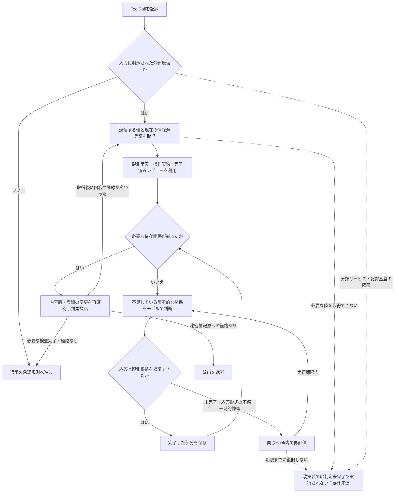

# 判定完了と復旧

2026-09-24。目的は処理速度の短縮ではなく、通常の利用を判定未完了で終わらせないこと。
本書には通常経路だけでなく、現在残っている失敗経路も記す。
**現状は「保留が絶対に起きない」という要件を満たしていない。**

## 実行可否と処理状態を分ける

実行可否の判断は「秘密情報源に由来する送信を遮断」「それ以外を許可」の二つ。
その前の計算中・再試行・証拠の取得失敗は、実行可否の判断ではない。
モデルのタイムアウトを秘密検出に変換せず、依存なしにも変換しない。
また、保留を別の名前に変えただけで要件を達成した扱いにしない。

図の復旧ループは無制限の実行を約束するものではない。既存の外側の期限と
Watchdogは残っており、復旧できない場合は依然として実行されない。
この出口を正常終了や検出成功に数えない。

## 今回、本体へ入れる修正

1. **一度できた判定は、後段の失敗で捨てない。**
   大きな履歴の分割だけでなく、一回で収まるレビューにもSQLiteの完了記録を作る。
   祖先の解析が失敗しても、完了した子の意味判定からやり直さない。
   再利用時には現在の観測・範囲・履歴・モデル／プロンプト版・証拠取得結果を照合し、
   応答と選択範囲も検証し直す。以前の送信許可を再利用する仕組みではない。
2. **モデルの未完了を、一度で最終的な保留へ送らない。**
   情報源との結び付けに必要な情報が揃っている場合、未完了の意味判定を同じ同期Hookで
   再評価する。3回で打ち切る扱いをせず、その呼び出しの実行予算内で続ける。
   前回の理由を未信頼の回答として渡し、対象範囲の取り違えを修復する。
   本当に欠けた証拠を補ったふりをしたり、`complete=true`へ上書きしたりしない。
3. **同じ短い時間制限で何度もモデルを切らない。**
   モデル通信のタイムアウト後は、そのHook内の次の試行に使える時間を増やす。
   上限はHookの残り時間。元の操作の再実行や、別経路での送信は行わない。
4. **復旧した事実を検証する。**
   未完了回答を4回入れた後で、秘密由来の送信は経路を持つblock、独立した送信はallowに
   到達することを本体の処理経路で確認する。`held=0`も検査する。
   キャッシュの破損、証拠の変更、モデルの時間切れ、復旧しない障害を別々に検査する。

`graph_review_parts`は完了記録、`graph_review_attempts`は再評価の履歴。
後者は許可を与える証拠ではない。登録変更は意味判定の再利用を妨げず、最後に現在の
登録を照合し直す。元のToolCallをバックグラウンドから再実行する処理は追加しない。

## プラグインの制約と、まだ解消していないこと

[CodexのHook仕様](https://developers.openai.com/codex/hooks)では、同期Hookには実行期限があり、
非同期Hookは元の操作の許可・遮断・書き換えをできない。
そのため、外部判定サービスが期限中ずっと使えないケースを、非同期Hookへ移すだけでは
解決できない。復旧しない障害でも、未判定を実行せず、操作も止めず、有限時間で正しく
判定するという三条件は、現在の観測と実行方式では保証できない。

今回の実装後も残るもの:

- 480秒の判定予算、720秒の子プロセスWatchdog、900秒のHook期限を越える失敗。
- 取得できない送信内容、必要な観測の欠損、対応していない情報源セレクター。
- DB・プロセス起動・ファイル権限など、モデルの再評価では復旧しない障害。
- 大きな履歴の候補比較と再帰的な来歴解析。局所分類の参照実装を、本番の置換完了としない。

今回の変更はこの制約を消すものではない。通常の判定を途中で終わらせる実装上の要因を
減らす修正であり、「保留ゼロで完成」というリリース判定には使わない。
機械的に確定できる受け渡しを増やすことと、観測内容の取得範囲を明確にすることは引き続き必要。
それでも永続障害下の保証とは区別する。

## 2026-09-24の実モデル確認

[scripts/check_judgment_recovery.py](../../scripts/check_judgment_recovery.py)で、
合成した記録を本体の `process_hook` に渡し、現在の `codex exec` 判定器を呼び出した。
実際のDesktop Hook配送や送信コマンドは実行していない。
実測結果は[JSON](../検証/judgment-recovery-20260924.json)に保存した。

|対象|結果|故障注入|Hook処理試行数|時間|
|---|---|---|---:|---:|
|登録原本と同じ内容|内容一致でblock|意味判定に進まないためなし|1|20.239秒|
|原本の数値・手順を英訳した内容|情報源への依存経路でblock|最初の意味判定だけ未完了|2|33.572秒|
|受付での案内文|allow|最初の意味判定だけ未完了|2|29.002秒|

3件とも最終状態はcomplete、heldは0。再要求を行わず、1回の `process_hook` 呼び出しで
完了した。小さな合成例による確認であり、全操作での無停止や意味判定の完全性の証明ではない。
